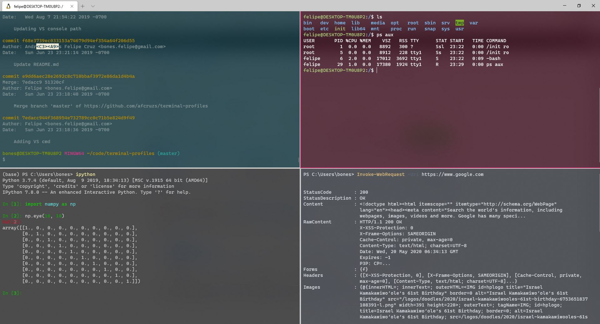

## My profiles for the [Windows Terminal](https://docs.microsoft.com/en-us/windows/terminal/)

Besides the automatically generated cmd, ps and ubuntu I have added:

- [Git bash](https://github.com/afcruzs/terminal-profiles/blob/f5c2c8650be2a6b79dd6c7e2b828cc178f9763c9/settings.json#L67)
- [Anaconda PS 3 prompt](https://github.com/afcruzs/terminal-profiles/blob/f5c2c8650be2a6b79dd6c7e2b828cc178f9763c9/settings.json#L58)
- [Developer command prompt for VS 2019](https://github.com/afcruzs/terminal-profiles/blob/f5c2c8650be2a6b79dd6c7e2b828cc178f9763c9/settings.json#L80).

Quick PS script to copy `settings.json` from this repo to the location in your machine:

`Copy-Item settings.json (Join-Path (Get-ChildItem -Path $env:userprofile\AppData\Local\Packages -Filter "Microsoft.WindowsTerminal_*" -Directory).Fullname "LocalState") -Force`
